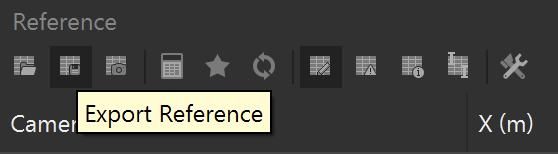

# **RSP DOCUMENTATION**

This document is the official documentation for RSP.

> **Please note.** This documentation is still a work in progress. The **Image Processor** is feature-complete and documented in full. The **Metashape** side of RSP, by contrast, is undergoing a major rework that will turn it into a proper plugin. The calibration workflow described here is accurate for the current scripts, but it will change once the plugin lands, so this part of the documentation is intentionally not being maintained in the meantime. Expect the procedure below to be superseded.

---

## Contents
- [GoPro Setup]() - *MISSING (REFER TO [ARTICLE](https://doi.org/10.1007/s00338-026-02947-3))*
- [RSP Image Processor]() - *MISSING (REFER TO [ARTICLE](https://doi.org/10.1007/s00338-026-02947-3))*
- [Stereo Baseline Calibration](#stereo-baseline-calibration)
  - [What calibration does and why it is needed](#what-calibration-does-and-why-it-is-needed)
  - [Requirements](#requirements)
  - [Step 1. Prepare the calibration target](#step-1-prepare-the-calibration-target)
  - [Step 2. Configure the cameras](#step-2-configure-the-cameras)
  - [Step 3. Acquire the calibration dataset](#step-3-acquire-the-calibration-dataset)
  - [Step 4. Sort and pre-process the images in RSP](#step-4-sort-and-pre-process-the-images-in-rsp)
  - [Step 5. Build the calibration project in Metashape](#step-5-build-the-calibration-project-in-metashape)
  - [Step 6. Run stereo_report.py](#step-6-run-stereo_reportpy)
  - [Step 7. Export the reference file](#step-7-export-the-reference-file)
  - [Step 8. Run stereo_calibration.py](#step-8-run-stereo_calibrationpy)
  - [Step 9. Read the calibration report](#step-9-read-the-calibration-report)
- [Scale a 3D reconstruction](#scale-a-3d-reconstruction)
  - [Apply the baseline with stereo_scale.py](#apply-the-baseline-with-stereo_scalepy)
- [When to recalibrate](#when-to-recalibrate)
- [Troubleshooting]() - *TO BE WRITTEN*
- [Frequent Asked Questions]() - *TO BE WRITTEN*

---

## Stereo Baseline Calibration

This guide describes how to calibrate the stereo baseline of an RSP camera rig and how to apply the resulting value when scaling reconstructions.

The calibration is currently a multi-step manual procedure that combines the RSP data manager with a set of Python scripts run inside Agisoft Metashape Pro. A Metashape plugin that automates the whole sequence is in development; see [Roadmap](#roadmap).

---

### What calibration does and why it is needed

A photogrammetric reconstruction built from a single moving camera is geometrically correct but dimensionless: the model has shape, but not size. Introducing a second camera at a fixed, known separation supplies that missing dimension. Every synchronised image pair observes the scene from two viewpoints whose relative distance is constant, so the reconstruction can be scaled without placing any physical reference object in the scene.

The purpose of calibration is to measure that separation, the **baseline**, as accurately as possible. It is not sufficient to measure the distance between the housings with a ruler: the value that matters is the distance between the optical centres of the two lenses, which sits somewhere inside each housing and cannot be reached directly.

The output is a single value in metres, together with a report describing how consistent the individual pair estimates were. That scale is then reused to scale every subsequent survey acquired with the same rig, for as long as the rig geometry is undisturbed.

---

### Requirements

**Hardware**

- An RSP rig with two cameras (`left`, `right`). Three-camera rigs are supported: the third position is treated as `center`.
- The printed scalebar sheet from `script/` (see Step 1), or your own set of coded targets with known separations.
- A rigid, flat surface on which to lay the targets.

**Software**

- Agisoft Metashape **Professional** edition. The Standard edition cannot run Python scripts and cannot be used for calibration.
- The RSP data manager (GUI or CLI).
- The scripts in `script/` of this repository:
  - `stereo_report.py`
  - `stereo_calibration.py`

**Conditions**

Calibration can be performed dry. In most cases a dry calibration is preferable because the targets stay flat and the session is quicker.

---

#### Step 1. Prepare the calibration target

A printable PDF of coded markers with certified spacings is included in the `script/` folder of this repository. Print it at **100 % scale**, with any "fit to page" or "shrink to fit" option disabled, then verify one known distance with a ruler or calipers before use. 

Custom targets are equally acceptable. The only requirement is that you know the distances between markers to a precision at least as good as the accuracy you expect from the final reconstruction. Mount the sheet on foam board, acrylic, or another rigid backing: paper that curls or lifts introduces error that is difficult to detect afterwards.

---

#### Step 2. Configure the cameras

Scan the RSP QR configuration code with each camera. You can the QR code under `Tools/GoPro QR code` in the RSP Image Processor. This sets the capture parameters shared across the rig.
Set the interval-shooting to 1s.

**The intervalometer must be set manually on each camera. The QR code do not set it.** 

Everything else in the capture configuration is applied by the QR code and should not be changed by hand.

---

#### Step 3. Acquire the calibration dataset

Lay the targets on the floor or on a rigid surface, then perform a normal photogrammetric acquisition over them.

Practical guidance:

- Cover an area of roughly **1 x 1 m**.
- Collect **50 to 70 images per camera**. In practice this is about a minute of capture.
- Move steadily around and across the target area, varying viewing angle and height so that each marker is seen from several directions. Convergent geometry produces a far more stable solution than a single flat pass.
- Keep the whole target in frame for both cameras as often as possible.
- Use even, diffuse lighting and avoid specular reflections on the printed sheet, which can defeat marker detection.

---

#### Step 4. Sort and pre-process the images in RSP

1. Download the images from each camera into **separate folders**, one per camera position: `left`, `right`, and `center` if the rig carries three.
2. Open RSP and import the folders, assigning each to its camera position.
3. Set a project **prefix**. Choose something that identifies the rig and the session, for example `rigA_calib_2026-08`.
4. Run **image processing**. It is not necessary to run the Image Enhancement if the calibration has not been performed in the water

RSP renames every file according to the pattern below, which is what allows the downstream scripts to recognise which images belong to which camera and which images form a pair:

```
<prefixs>_left_XXXX
<prefixs>_right_XXXX
<prefixs>_center_XXXX
```

**Do not rename or reorder the outputs after this step.**

---

#### Step 5. Build the calibration project in Metashape

1. Create a new Metashape project and add **all** the renamed images, from every camera, into a single chunk.
2. Detect the markers: **Tools > Markers > Detect Markers**. Confirm that the detected target type matches the printed sheet.
3. Check the Markers pane. Every marker on the sheet should appear, and none should be duplicated or obviously misplaced. Correct any stray detections before continuing.
4. Align the photos as you normally would for a dataset.
5. Enter the **known distances between markers** as scale bars in the Reference pane, then click **Update**.
6. Inspect the scale bar errors. A well-behaved calibration project shows residuals that are small and consistent; a single scale bar with an error far larger than the others usually means a mistyped distance or a mislabelled marker.

At this point the chunk is correctly scaled in metric units and the camera positions are known. The scripts take over from here.

---

#### Step 6. Run stereo_report.py

In Metashape, choose **Tools > Run Script...** and select `script/stereo_report.py`.

The script inspects the aligned chunk and reports on the stereo pairs it finds: how many pairs were matched and which cameras were aligned.

---

#### Step 7. Export the reference file

Export the camera reference data from Metashape and save it as a plain text file, for example `references.txt`.

- Use the export dialog shown below
  .
- Match the settings shown in the image below **exactly**. The parser in `stereo_calibration.py` expects a specific column order and delimiter, and a file exported with different settings will either fail to load or, worse, load with columns transposed.


---

#### Step 8. Run stereo_calibration.py

Still in Metashape, choose **Tools > Run Script...** and select `script/stereo_calibration.py`.

The script prompts for two paths, in this order:

1. **Input:** the reference file exported in Step 7, for example `references.txt`.
2. **Output:** where to write the calibration results, for example `calibration.txt`.

It then computes the baseline for every valid pair and derives a single recommended baseline from that distribution.

When the script finishes, the recommended value is printed in a Metashape window. This is the quick answer, and it is the same value that appears in the report file.

---

#### Step 9. Read the calibration report

Open `calibration.txt`. It contains a fuller account of the calibration: summary statistics describing their spread, and the recommended baseline to adopt.

Record the adopted baseline somewhere durable alongside the rig itself, together with the date and the rig identifier. It is easy to lose track of which value belongs to which rig once you are running more than one.

**Calibration is now completed**

## Scale a 3D reconstruction

This part of the pipeline, while providing the basic functions to retrieve a scaled model, is currently under-documented. Further details will be provided in the future.

### Apply the baseline with stereo_scale.py

After the calibrated baseline has been retrieved, is what scales all subsequent reconstructions from that rig.

For each new survey:

1. Process the imagery through RSP and align it in Metashape as usual.
2. Run **Tools > Run Script...** and select `script/stereo_scale.py`.
3. Supply the baseline from `calibration.txt` when prompted.

The script applies the known camera separation (baseline) as the scale constraint for the chunk, so no scale bars or reference objects are needed in the survey.

---

## When to recalibrate

Recalibrate whenever the physical relationship between the cameras may have changed:

- after any disassembly, remounting, or opening of the housings;
- after a knock, a drop, or shipping;
- when moving to a different rig or swapping a camera body;
- periodically during long field campaigns, as a check on drift.

A calibration takes about a minute of capture and a short processing run. Repeating it when in doubt costs far less than discovering afterwards that a season of surveys was scaled with a wrong value.

---

*Last updated: `24/08/2026`*
